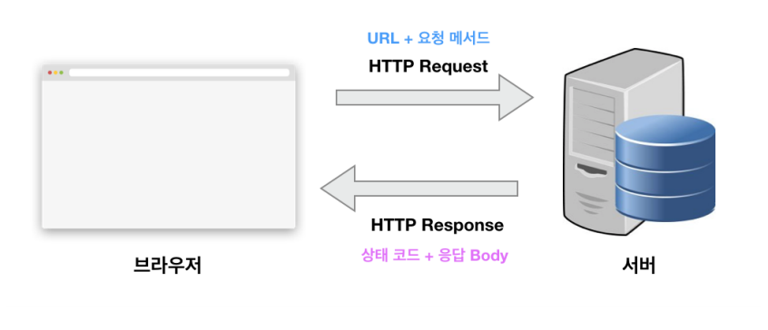

## 크로스 브라우징

**브라우저의 엔진이 다름을 고려하여 모든 브라우저에서 동일하게 동작할 수 있도록 작성하는 기법**

* 브라우저마다 엔진이 달라 HTML5, CSS, JS가 작동되지 않을 수 있음
* 이는 특정 브라우저에서 JS코드 에러, CSS 깨짐 등을 의미
  * **예로** IE 등 구형 브라우저에서는 W3C 웹 규격을 완벽히 따르지 않아서 위의 에러 발생 가능
* **Babel** 등의 크로스 브라우징 도구가 존재함
* 이와 유사하게 응용 프로그램에서는 **크로스 플랫폼**이라는 이슈가 있음

 

## HTTP 통신

### HTTP 통신의 구조

**HTTP는 요청과 응답으로 구성된 데이터 교환 규칙**

* 클라이언트가 HTTP Request를 서버에 보내면, 서버는 HTTP Response를 돌려주는 구조
* HTTP는 **stateless**이기 때문에 상태를 저장하지 않으며, 데이터가 필요하면 계속해서 데이터를 요청하고 응답받는 형태이다. 즉, 연결을 유지하지 않고 통신을 한다.
* 크게 세 부분으로 구성 : **StartLine, Headers, Body**

 

## HTTP 요청 메소드

**GET, POST, PUT, PATCH, DELETE, OPTIONS 등의 메소드가 있음**

 

## HTTP 응답 구조

**응답 상태 코드와 Headers로 통신에 관한 정보, body를 통해 데이터를 받아옴**

